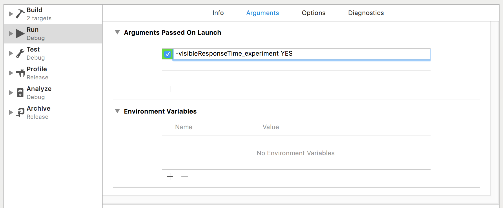

# Experiment

[](https://github.com/Carthage/Carthage)
[](https://swift.org/package-manager)

Create experimental features within your app that can be enabled and disabled. It's intentionally kept simple to allow for easy use alongside a variety of other tools.

* [Usage](#usage)
    * [Configure the Storage](#configure-the-storage)
    * [Define Your Experiments](#define-your-experiments)
    * [Turn On Experiments For Users](#turn-on-experiments-for-users)
    * [Developer: Enable Experiments in Xcode](#developer-enable-experiments-in-xcode)
    * [Cleanly Remove Experiments](#cleanly-remove-experiments)
* [Installation](#installation)
    * [Carthage](#carthage)
    * [Swift Package Manager](#swift-package-manager)
    * [Git Submodules](#git-submodules)


## Usage

### Configure the Storage

The settings for each experiment are stored in a `UserDefaults` suite, and typically
you should configure it to be a suite defined by a [shared App Group](https://developer.apple.com/library/content/documentation/General/Conceptual/ExtensibilityPG/ExtensionScenarios.html#//apple_ref/doc/uid/TP40014214-CH21-SW6).

```swift
class AppDelegate: UIResponder, UIApplicationDelegate {
    func application(_ application: UIApplication, didFinishLaunchingWithOptions launchOptions: [UIApplicationLaunchOptionsKey: Any]?) -> Bool {
        Experiment.defaults = UserDefaults(suiteName: "group.com.example.myapp.shared")!
    }
}
```


### Define Your Experiments

You'll define named experiments in an extension on `Experiment`, then refer to
individual experiments within UI code to make decisions about display or processing. They aren't required, but it keeps stringly-typed access out of your day-to-day code.

```swift
extension Experiment {
    // See: https://goodui.org/fastforward/patterns/24/
    static var visibleResponseTime = Experiment.named("visibleResponseTime")
}

class SupportViewController: UIViewController {
    func configureView() {
        if Experiment.visibleResponseTime.enabled {
            view.addSubview(self.responseTimeLabel)
        }
    }
}
```


### Turn On Experiments For Users

You may choose to turn on an experiment for a user any way you want. This may be
in response to an API call, or even a button click on the user interface.

```swift
class BetaViewController: UIViewController {
    func toggleVisibleResponseTime() {
        Experiment.visibleResponseTime.enabled = !Experiment.visibleResponseTime.enabled
    }
}
```

_Custom URL_

You can also use a custom URL to turn on the experiments, if your app has implemented a custom URL scheme.

```swift
class AppDelegate: UIResponder, UIApplicationDelegate {
    func application(_ app: UIApplication, open url: URL, options: [UIApplicationOpenURLOptionsKey: Any] = [:]) -> Bool {
        if Experiment.configure(from: url) {
            return true
        }
        // Your custom URL code
        return false
    }
}
```

Turn it on: `myapp://experiments/configure?visibleResponseTime=true`

Turn it off: `myapp://experiments/configure?visibleResponseTime=false`

Delete it: `myapp://experiments/configure?visibleResponseTime=`

Multiple experiments: `myapp://experiments/configure?visibleResponseTime=false&adminTools=true`


### Developer: Enable Experiments in Xcode

To use a specific setting during development in Xcode, edit your scheme and add a value to
"Arguments Passed on Launch" and then your app will act as if the setting was enabled, but
without storing that setting in the Simulator itself.

    -visibleResponseTime_experiment YES




### Cleanly Remove Experiments

When your need for an experiment is done, do the following:

  1. Remove all code that uses the value, and delete the code branch that is no longer valid.
  2. Remove the static var in your extension of `Experiment`.
  3. In migration code, call `Experiment.named("visibleResponseTime").remove()`.


## Installation

### Carthage

[Carthage](https://github.com/Carthage/Carthage) is a decentralized dependency manager that builds your dependencies and provides you with binary frameworks.

You can install Carthage with [Homebrew](http://brew.sh/) using the following command:

```bash
$ brew update
$ brew install carthage
```

To integrate Experiment into your Xcode project using Carthage, specify it in your `Cartfile`:

```ogdl
github "timshadel/Experiment" ~> 1.0
```

Run `carthage update` to build the framework and drag the built `Experiment.framework` into your Xcode project.

### Swift Package Manager

You can use [The Swift Package Manager](https://swift.org/package-manager) to install `Experiment` by adding the proper description to your `Package.swift` file:

```swift
import PackageDescription

let package = Package(
    name: "YOUR_PACKAGE_NAME",
    targets: [],
    dependencies: [
        .Package(url: "https://github.com/timshadel/Experiment.git", majorVersion: 1)
    ]
)
```

Note that the [Swift Package Manager](https://swift.org/package-manager) is still in early design and development. For more information check out its [GitHub Page](https://github.com/apple/swift-package-manager)


### Git Submodules

- If you don't already have a `.xcworkspace` for your project, create one. ([Here's how](https://developer.apple.com/library/ios/recipes/xcode_help-structure_navigator/articles/Adding_an_Existing_Project_to_a_Workspace.html))

- Open up Terminal, `cd` into your top-level project directory, and run the following command "if" your project is not initialized as a git repository:

```bash
$ git init
```

- Add Experiment as a git [submodule](http://git-scm.com/docs/git-submodule) by running the following command:

```bash
$ git submodule add https://github.com/timshadel/Experiment.git Vendor/Experiment
```

- Open the new `Experiment` folder, and drag the `Experiment.xcodeproj` into the Project Navigator of your application's Xcode workspace.

    > It should not be nested underneath your application's blue project icon. Whether it is above or below your application's project does not matter.

- Select `Experiment.xcodeproj` in the Project Navigator and verify the deployment target matches that of your application target.
- Next, select your application project in the Project Navigator (blue project icon) to navigate to the target configuration window and select the application target under the "Targets" heading in the sidebar.
- In the tab bar at the top of that window, open the "General" panel.
- Click on the `+` button under the "Linked Frameworks and Libraries" section.
- Select `Experiment.framework` inside the `Workspace` folder.
- Click on the `+` button under the "Embedded Binaries" section.
- Select `Experiment.framework` nested inside your project.
- An extra copy of `Experiment.framework` will show up in "Linked Frameworks and Libraries". Delete one of them (it doesn't matter which one).
- And that's it!
